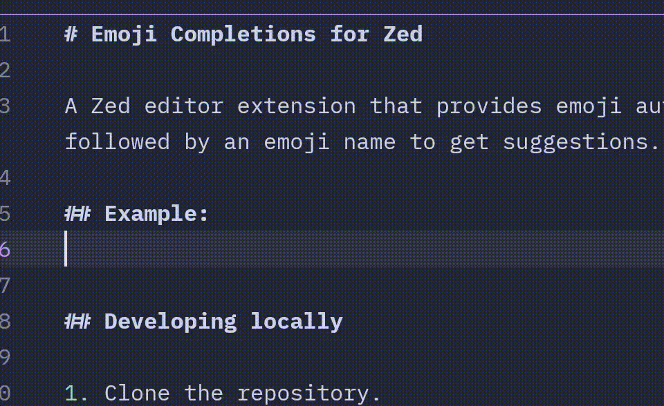

# Emoji Completions for Zed

A Zed editor extension that provides emoji autocompletion similar to Slack. Type `:` followed by an emoji name to get suggestions.

## Example:



## Developing locally

1. Clone the repository.
2. Build using `cargo build --release`.
3. Copy the `emoji-language-server` binary to your Zed extensions directory:
   ```sh
   mkdir -p ~/.zed/extensions/emoji-completions
   cp target/release/emoji-language-server ~/.config/zed/extensions/emoji-completions
   ```
4. Use the `zed: install dev extension` command in Zed to install the extension from the local path.
5. Restart all language servers in Zed

## Making a release

This project uses immutable tags, which makes releasing a new version a bit more complicated than it would otherwise be.

1. Bump the version in `Cargo.toml` and `extension.toml`, name the new version something like `1.0.0-beta0`.
2. Tag a pre-release in git:
  ```sh
  git tag 1.0.0-beta0
  git push origin 1.0.0-beta0
  ```
3. The release will now be built, but it will be marked as a pre-release build. Mark the build as a pre-release in the GitHub UI.
4. Build locally with `cargo build --release`.
5. Remove any existing `emoji-language-server` binary from the Zed extensions directory:
   ```sh
   rm -f ~/.zed/extensions/emoji-completions/emoji-language-server
   ```
6. Use the `zed: install dev extension` command in Zed to install the extension from the local path.
7. Restart all language servers in Zed, this should trigger the new version to be used.
8. Test that everything works as expected.
9. Once verified, create a new tag for the stable release, e.g., `1.0.0`:
   ```sh
   git tag 1.0.0
   git push origin 1.0.0
   ```
10. Publish this release as the latest release
11. Update the zed-extensions repo to point to the new version, in accordance with their instructions: https://zed.dev/docs/extensions/developing-extensions#updating-an-extension

## Possible improvements (PRs welcome!)
- Add support for skin tone modifiers.
- Better search
- Enable emoji markup support similar to emojisense (e.g. `::smile` inserts `:smile`)
- Configuration for which languages to enable emoji completions in.
- Non-language specific support (I don't think Zed supports this yet?). Currently this only works in file types where the language server is explicitly activated. Confirmed here: https://github.com/zed-industries/extensions/pull/3941#pullrequestreview-3500665902

## Credits

Inspired by the Emojisense extension for Visual Studio Code: https://github.com/mattbierner/vscode-emojisense
