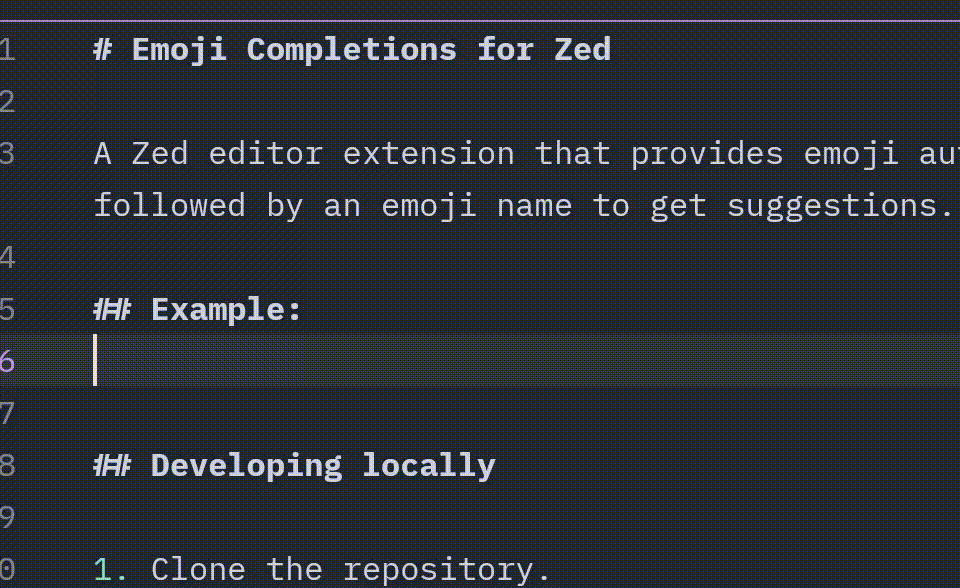

# Emoji Completions for Zed

A Zed editor extension that provides emoji autocompletion similar to Slack. Type `:` followed by an emoji name to get suggestions.

## Example:



## Turning it off for a language

Add this to your Zed `settings.json`, using the language name Zed shows in the status bar:

```json
"languages": {
  "Rust": {
    "language_servers": ["!emoji-language-server", "..."]
  }
}
```

Zed only starts the server for languages listed in `extension.toml`, so it cannot be turned on for other languages this way.

## Developing locally

1. Clone the repository.
2. Build using `cargo build --release`.
3. Point Zed at the built server in your Zed `settings.json`:
   ```json
   "lsp": {
     "emoji-language-server": {
       "binary": { "path": "/path/to/emoji-completions-zed/target/release/emoji-language-server" }
     }
   }
   ```
4. Use the `zed: install dev extension` command in Zed to install the extension from the repository directory.
5. After rebuilding, run `editor: restart language server` in Zed to pick up the new binary.

## Making a release

This project uses immutable tags, which makes releasing a new version a bit more complicated than it would otherwise be.

1. Bump the version in `Cargo.toml` and `extension.toml`, name the new version something like `1.0.0-beta0`.
2. Tag a pre-release in git:
  ```sh
  git tag 1.0.0-beta0
  git push origin 1.0.0-beta0
  ```
3. The release will now be built, but it will be marked as a draft. Mark the build as a pre-release in the GitHub UI.
4. Build locally with `cargo build --release`.
5. Remove any downloaded `emoji-language-server` binaries from the Zed extensions directory, and remove the `lsp` setting from "Developing locally" if you added it:
   ```sh
   # Linux
   rm -f ~/.local/share/zed/extensions/work/emoji-completions/emoji-language-server-*
   # macOS
   rm -f ~/Library/Application\ Support/Zed/extensions/work/emoji-completions/emoji-language-server-*
   ```
6. Use the `zed: install dev extension` command in Zed to install the extension from the local path.
7. Restart all language servers in Zed, this should trigger the new version to be used.
8. Test that everything works as expected.
9. Once verified, create a new tag for the stable release, e.g., `1.0.0`:
   ```sh
   git tag 1.0.0
   git push origin 1.0.0
   ```
10. Publish this release as the latest release
11. Update the zed-extensions repo to point to the new version, in accordance with their instructions: https://zed.dev/docs/extensions/developing-extensions#updating-an-extension

## Possible improvements (PRs welcome!)
- Add support for skin tone modifiers.
- Enable emoji markup support similar to emojisense (e.g. `::smile` inserts `:smile:`)
- Non-language specific support (I don't think Zed supports this yet? Confirmed here: https://github.com/zed-industries/extensions/pull/3941#pullrequestreview-3500665902). Currently this only works in file types where the language server is explicitly activated.

## Credits

Inspired by the Emojisense extension for Visual Studio Code: https://github.com/mattbierner/vscode-emojisense
